# Código

Existen muchas formas de programar, algunas más eficientes que otras, o que utilizan más o menos recursos. El código que se presenta en esta sección tiene como objetivo servir de referencia al momento de crear uno propio. Se asumirá que el lector cuenta con conocimientos previos de programación, por lo que se proporcionará una explicación breve del código para facilitar su comprensión y posible adaptación.

## Tabla de contenidos

1. [Declaración](#declaración)
2. [void setup](#void-setup)
3. [void loop](#void-loop)
4. [void floor_move](#void-floor_move)
5. [void conditions](#void-conditions)
6. [void read](#void-read)
7. [void atacar](#void-atacar)
8. [void one](#void-one)
9. [void move](#void-move)
10. [Motores](#motores)

## Declaración

Se incluye la librería FastLED para configurar y controlar los dos LEDs RGB que se encuentran en la PCB. Se define el número de LEDs, en este caso 2 RGB, y el número del pin que transmite los datos (D10). Por último, se declara el arreglo CRGB leds[] con el número de LEDs a utilizar.

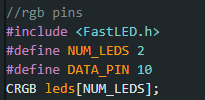

Se declaran los pines de la TB. Los pines están serigrafiados en la PCB.

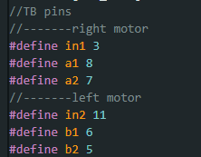

Se declaran los pines donde están conectados los sensores, el botón pulsador y el arrancador.

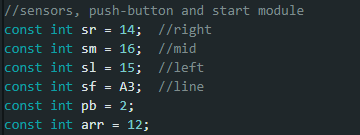

Se declaran las variables necesarias para conocer el estado de los sensores, el botón y el arrancador.

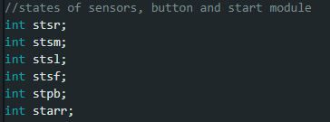

Por último, se declara el pin del LED y las variables auxiliares que se ocuparán en el resto del código.

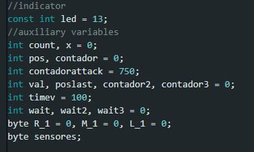

## void setup

No hay mucho que explicar, más que se realiza una modificación al prescaler en la primera sentencia, lo que permite ajustar la frecuencia del temporizador. Posteriormente, se inicializan y configuran los LEDs RGB utilizando la librería FastLED.

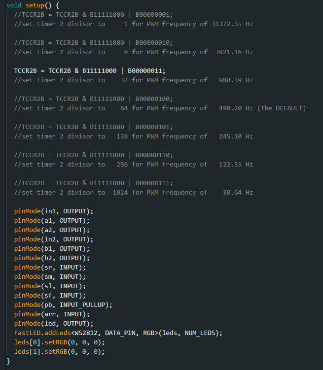

## void loop

Se estará leyendo el estado del arrancador. Mientras su estado sea 0 (estado bajo), se leerá el estado del pulsador. Si el pulsador es presionado, se realizará una sumatoria en cada pulsación, y se encenderá el LED. Cuando el estado del arrancador sea 1 (estado alto), se llamará a la función floor_move(). Si el arrancador vuelve a un estado bajo, el ciclo se rompe, y todo se reinicia estableciendo los valores en 0.

## void floor_move

En esta función, se estarán leyendo los valores analógicos del sensor de línea. Si el valor leído es menor o igual a 60, se llamará a la función move(), lo que indica que se detectó la línea blanca. Si el valor supera este umbral, se llamará a la función conditions(count), pasando como parámetro el conteo de las pulsaciones del botón.

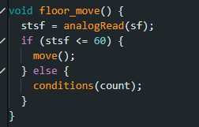

## void conditions

En la función, si el parámetro no está dentro de los casos definidos en el switch-case, será enviado al caso default, y se llamará a la función atacar(). Si la pulsación es 1 o corresponde a alguno de los casos definidos, se ejecutará el código correspondiente a esos casos.

## void read

Esta función es la más grande del código. Primero, lee los estados de los sensores. Luego, se encuentra un arreglo de condiciones if-else para cada sensor, asignándole un valor a una variable byte. Posteriormente, se realiza una sumatoria de estas variables byte y el resultado se guarda en otra variable byte, que contiene los valores combinados de los sensores. Esta variable se utiliza como parámetro en el switch-case. Dependiendo de la lectura, una variable pos tomará un valor específico, al igual que los LEDs. En la última parte del código se tiene un arreglo de sentencias if que guarda, por un breve periodo, la última posición del sensor que detectó. Por ejemplo, si fue el derecho el último en detectar, el valor correspondiente a "derecho" se guarda en la variable pos por medio segundo. Esto hace que el motor gire un poco más a la derecha. Obviamente, mientras el robot va girando y detecta la posición "izquierda", el motor se girará a la izquierda. Es bastante útil si se llega a perder la detección del robot oponente. Si no te funciona o covence lo podrias borrar y no habria problema. 

## void atacar

Se llama a la función read(), la cual retorna la variable pos. Esta variable servirá como parámetro para el switch-case, y dependiendo de su valor, se determinará cómo mover los motores.

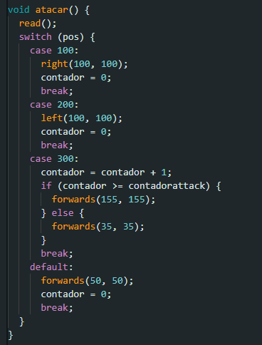

## void one

No hay mucho más que decir, simplemente gira durante un tiempo y luego pasa a la función atacar.

## void move

Esta función sirve para mover el microsumo cuando detecta la línea blanca. Hay varias formas de hacer esto, a lo mejor no es la más eficiente, pero cumple su propósito.

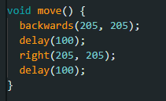

## Motores

Por último, se tienen las funciones para la dirección de los motores. Existen dos tipos de "stop", y esto depende del tipo de driver que estés utilizando. En este caso, uno desenergiza los motores y el otro los manda a corto. Se sugiere revisar la hoja de datos del controlador que se esté utilizando.

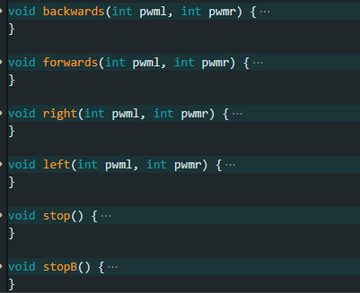

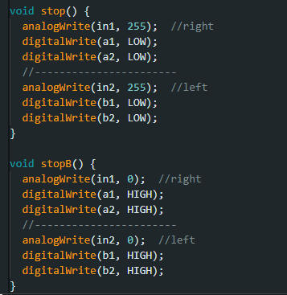

Fue una explicación bastante breve pero esperamos que sea entendida y te sirva a la hora de realizar un prototipo de esta categoria.
