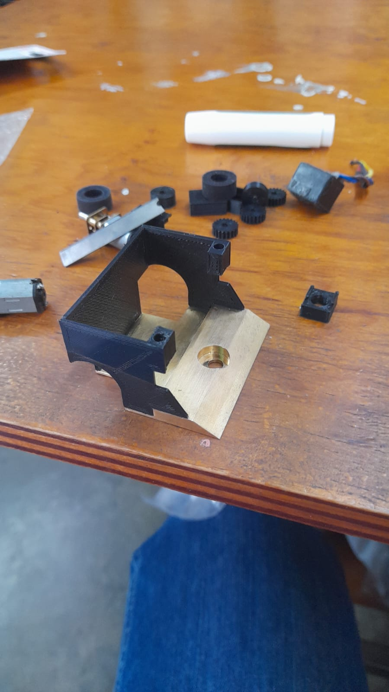
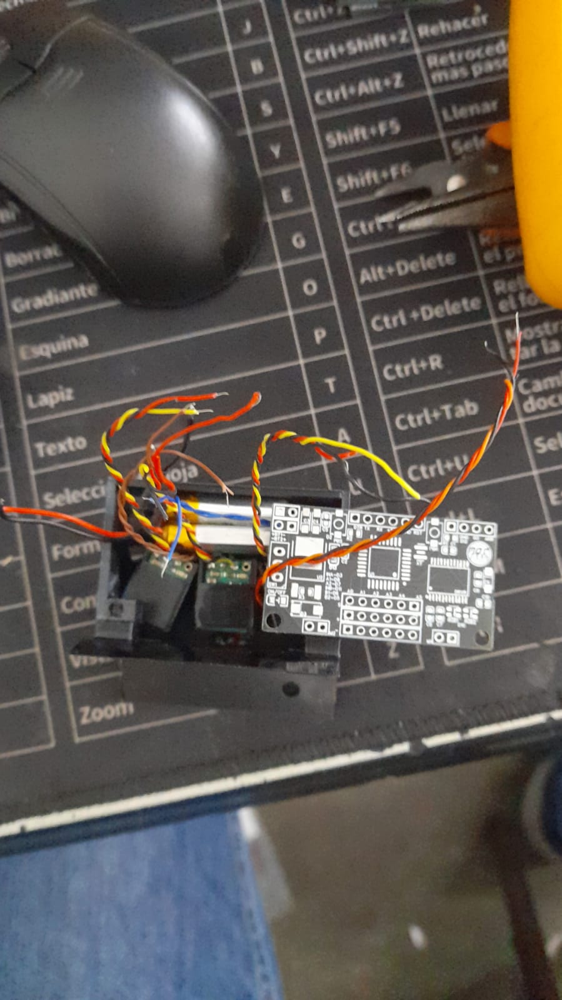
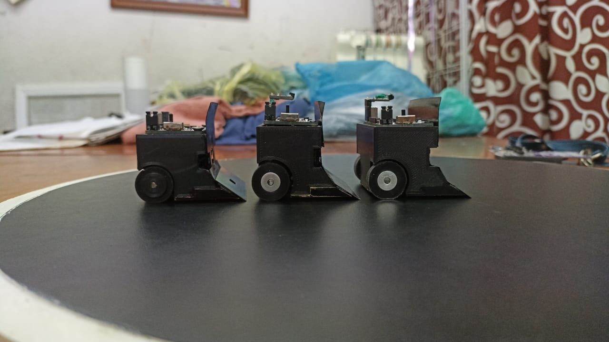
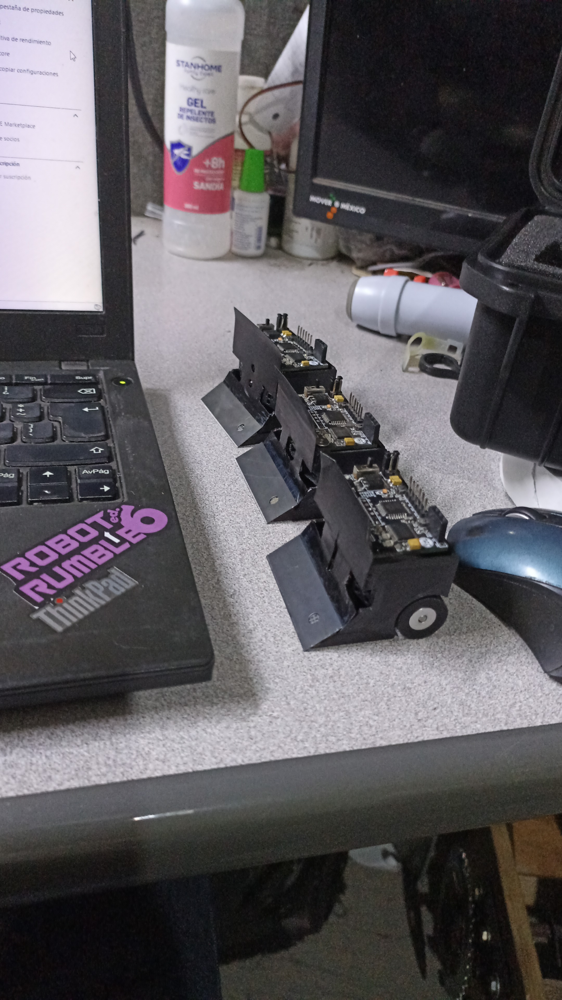

# Diseño y Ensamble

El diseño del prototipo, al igual que el diseño de la PCB o la programación, evoluciona con el tiempo. Se prueba una cosa y otra, y aunque al principio puede que no se tenga un buen prototipo (o si), después de dos o tres competencias podrías identificar aspectos que necesiten cambios. Nuevas ideas y mejoras siempre surgen. Por eso, en esta parte del repositorio se presentará una idea general del diseño mecánico del robot, así como del ensamble del prototipo. Como en todo el repositorio, puedes seguir estos pasos al pie de la letra o adaptarlos según tus necesidades.

***Aunque sé que dice "Diseño", y lo más probable es que se piense que aquí enseñaré cómo diseñar un microsumo, la realidad es que con los archivos que se están compartiendo ya se tiene una idea clara de cómo hacerlo. Por lo tanto, esta sección se centrará más en consejos prácticos y el ensamblaje del prototipo.***

## Tabla de Contenidos
1. [Descripción](#descripción)
2. [Base latón](#base-latón)
3. [PLA](#PLA)

## Descripción

El archivo base_microsumo_pro.rar contiene una base diseñada en SolidWorks (versión 2019), destinada a ser fabricada en latón. Puede ser enviada a maquilar en JLCPCB, PCBWAY, o cualquier otro lugar. Este archivo es totalmente modificable y lo puedes ajustar según tus necesidades.

No es fundamental usar una base de latón en un microsumo, versiones anteriores que se han realizado, la carcasa del robot ha sido completamente de PLA con peso muerto (plomo), ha funcionado bastante bien, así que, si se prefiere usar PLA y plomo es una opción bastante viable, en el archivo Microsumo_v10.rar es una idea de lo que se usaba. Igual es totalmente modificable.

***Tip***
- El ángulo donde se coloca la navaja generalmente varía entre 20° y 30° de inclinación. Como recomendación, se sugiere usar un ángulo de 27°.

## Base latón

Una vez que se tiene la base de latón en proceso de fabricación o en su posesión, ya sea que se haya mandado a hacer con la opción presentada, modificado el diseño existente o incluso creado uno propio, se procederá a diseñar la carcasa del prototipo. 

Para esto, daré dos opciones que he utilizado, las cuales llamaremos *Paredes* y *Base Sensores*. 
- Paredes: Como su nombre lo indica, se tendran las paredes laterales y trasera, fabricadas de PLA o cualquier otro filamento.
- Base Sensores: consiste en una pequeña base donde se colocaran los sensores y la tapa frontal, también fabricada de PLA.

En ambas opciones, la tapa frontal será construida de una herramienta conocida como [cuña](https://www.brochasexito.com.mx/productos/Accesorios/Cunas-Exito-de-Acero), esta herramienta se puede conseguir en COMEX (Mexico).

### Paredes

Se diseñará en la parte de arriba de la base algo como lo siguiente.

Las medidas dependerán de los sensores, batería(s), llantas y motores que se estén utilizando. En el ejemplo anterior se emplearon dos baterías de litio de 3.7V y 140mAh (RADOX), tres sensores de proximidad IR Pololu 38kHz de ganancia fija, dos micromotorreductores N20 de relación 30:1, un sensor QTR (de autoría propia), además de un par de rines y llantas.

Aunque se pueden hacer mejoras, por ejemplo:
- La tapa trasera podría reducirse a 1 mm o 0.5 mm.
- La medida de 28.5 mm podría ajustarse a 25 mm.
- La altura de 30 mm podría reducirse a 25 mm o 27 mm.

Estos cambios modificarían ciertas partes del diseño, pero considero que quedarían a la perfección. Es cuestión de experimentar con lo que se tiene y ajustar según las necesidades.

#### Ensamblaje

Se puede pintar la base o colocar una pegatina, ya sea en un acabado totalmente negro, brillante o mate o tipo fibra de carbono. Esto dependerá del gusto de cada persona.

Una vez que se tienen las impresiones en 3D de las paredes, estas se fijan a la base de latón utilizando Kola-Loka. Coloquen pared por pared, con calma, para tener un mejor resultado. El resultado final debería verse de la siguiente manera.

A partir de aquí, el ensamblaje será el mismo si se utilizan motores N20 rectos, ya que existen diferentes modelos. ¿Qué significa que será el mismo? Justamente eso: sin importar cuál opción se utilice (Paredes o Base Sensores, con base de latón o PLA), la forma en la que se colocarán los motores y cómo se transmitirá la potencia será igual para todas las configuraciones. Por lo tanto, se explicará el proceso con el máximo detalle.

La idea es colocar los motores comos se muestra en la figura de abajo. 
Para fijar los motores a la base, se utiliza Kola-Loka. Como sugerencia adicional, se podría agregar un poco de bicarbonato a la mezcla. Esto genera una sustancia más fuerte y resistente.

***Tip***

- Supondremos que ya se cuentan con las llantas. Una sugerencia importante que deben seguir al pie de la letra es no fijar los motores al 100%. Utilicen únicamente la cantidad necesaria de Kola-Loka para que los motores queden semifijos y no se muevan.
Una vez que estén semifijados, coloquen las llantas y verifiquen que no haya desnivel utilizando un espejo (por el reverso del mismo). Es fundamental asegurarse de que la parte donde se colocará la navaja quede recargada de manera uniforme sobre la superficie. Esto para que cuando se coloque la navaja no tengan un lado alzado.

Para lograr esto, hay un aspecto que se debe observar con detalle: debido a las medidas, los motores no pueden colocarse de forma colineal. La solución consiste en configurar el sistema de la siguiente manera: se utilizan dos engranajes del mismo tamaño, lo que permite tener una relación 1:1. En esta configuración, un engranaje está conectado al eje del motor y el otro a una caja de reducción.

Existe otra forma de implementar esta configuración, que consiste en colocar un rodamiento en una pieza impresa en 3D y usar un eje de motor. Aunque esta opción resulta útil, en mi experiencia, no proporciona el resultado deseado. Por esta razón, se optó por utilizar una caja de reducción de los mismos motores, pero únicamente la última parte, que es la encargada de sostener el eje. Esta solución resulta bastante práctica y funcional.

En las tres figuras de abajo se muestran ejemplos del sistema con rodamiento.

***Tip***

- Los rines y engranes pueden fabricarse en PLA. Personalmente, suelo utilizar rines de aluminio y engranajes de PLA. Sin embargo, en AliExpress he encontrado engranajes de latón, que podrían resultar bastante útiles dependiendo de la aplicación.

- En cuanto a las llantas, aquí en México las consigo a través de compañeros de otros equipos que las venden. Parece que siempre es un reto conseguir esas llantitas.

Para este punto, ya se deben tener fijadas las paredes y los motores, asegurándose de que no haya ningún desnivel. A continuación, se procederá con la colocación de los sensores, las baterías y la PCB.

Baterías:

 - Primero, coloca las baterías en la parte trasera. Estas se pueden acomodar según las necesidades del diseño o el espacio disponible.

Sensores:

 - Coloca el sensor de piso utilizando un poco de silicona para fijarlo en su lugar.

 - Luego, instala los sensores IR. Aquí, el proceso dependerá del modelo de sensores que estés utilizando.

Nota sobre los sensores:

 - Los sensores más recomendables son los RZ60S de Sumozade, una empresa turca. Debido a sus dimensiones, son ideales para este tipo de robots. Si no es posible conseguirlos o no están disponibles al momento de ensamblar el prototipo, otras opciones viables son los JS40F de Jsumo (también turca) o los sensores Pololu mencionados anteriormente. O bien cualquier tipo de sensor con los que cuentes.

En este caso, se utilizaron sensores Pololu, lo que permitió que el prototipo adquiriera la siguiente forma a medida que avanzaba el ensamblaje.

Si se utilizan sensores Pololu, aquí van algunos consejos útiles:

1. Diseñar una carcasa específica para los sensores:
   - Fija los sensores a la carcasa con silicona en la parte trasera. Esto no solo asegurará que los sensores queden firmes en su lugar, sino que también ayudará a proteger los cables soldados, evitando que se desprendan o se dañen.

3. Colocar cinta aislante en la parte superior:
   - Esto es importante debido a los emisores del sensor, ya que la cinta ayudará a reducir interferencias o lecturas erráticas.

4. Considerar una carcasa alternativa:
   - Si el diseño inicial no es suficiente o no se ajusta a tus necesidades, puedes optar por diseñar una carcasa diferente que se adapte mejor al prototipo.

5. Características del sensor Pololu:
   - Pin de enable: Permite habilitar o deshabilitar el emisor del sensor según sea necesario.
   - Potenciómetro (pot): Facilita la regulación de la distancia de detección.

PCB:
 
 - La PCB se fija a las paredes colocando un tornillo M3, se puede colocar un inserto en las paredes para que despues se coloque el tornillo.

En este paso, se coloca la PCB y, posteriormente, se sueldan los cables de los motores y sensores. Es importante soldar las baterías primero, ya que su posición puede dificultar la soldadura una vez que la PCB esté colocada. Alternativamente, puedes soldar todo el cableado antes de fijar la PCB para mayor comodidad. 

Tapa frontal:

 - La tapa frontal puede cortarse con la ayuda de un esmeril angular 4" (o como lo conozcas) y, utilizando un Dremel, se realiza el corte en la sección destinada para los sensores.

 - Se presenta la tapa y se enciende el robot para verificar que los sensores no presenten problemas de interferencia con esta. Se sugiere pintar la tapa de negro por ambos lados para evitar reflejos o interferencias ópticas.

La tapa se fija a las paredes, usando Kola-Loka.

Ya se han colocado las paredes, motores, sensores, baterías, tapa y llantas; lo único que resta es colocar la navaja.

Es importante elegir el tipo de navaja adecuado. En las primeras versiones del prototipo, se utilizaban navajas de cúter pequeño, las cuales se cortaban a la medida de 50 mm. Más adelante, un compañero de competencia me regaló una navaja Kanzawa de 50 mm. Desde entonces, he utilizado este tipo de navajas, que son de origen japonés y un poco complicadas de conseguir, pero no imposible.

Existen otras opciones, pero como con todo lo mencionado en este repositorio, dependerá del ingenio y creatividad que se apliquen al proyecto.

Para colocar la navaja a la base se utiliza cinta doble cara. Hay en el mercado bastante opciones, aqui dare dos opciones, cinta que se consigue en [Walmart Cinta de Montaje Ceys Montack Doble Cara Rojo](https://super.walmart.com.mx/ip/cinta-de-montaje-ceys-montack-doble-cara-rojo-2-5-m/00841151977240?adBanner=super&adStoreId=0000009999&wl13=5727&utm_source=google&utm_medium=cpc&utm_advertiser=wmod_lia-multi-channel-all&utm_campaign=wmod_lf_sem_sitio_conversion_ao_shopping-lia-multi-channel-all&utm_term=_&utm_content=&gad_source=1&gclid=CjwKCAiAgoq7BhBxEiwAVcW0LGG02QXZycH2BXxB4lqzJFFQHLYqDIytriO6XkfnCFHCVhs3XfGuQRoCTu0QAvD_BwE) y en Aliexpress [Cinta de doble cara súper fuerte de 5M](https://es.aliexpress.com/item/1005006277925414.html?sourceType=1&spm=a2g0o.wish-manage-home.0.0&gatewayAdapt=glo2esp).

***Tip***

- Número de sensores: Este número puede variar dependiendo del gusto o las necesidades del diseño. Usualmente, he utilizado 4 sensores: uno para el piso y tres para la detección del oponente. La colocación también depende de lo que desees lograr. Puedes optar por poner uno que mire hacia enfrente y dos en los laterales, de forma que los emisores sean visibles pero los receptores no. O bien, puedes poner los receptores visibles y los emisores ocultos.
- Colocación de la navaja: Para colocar la navaja, coloca un poco de cinta en la parte de la navaja, usando no más de la mitad de la superficie. Luego, pégala a la base. Con un espejo, coloca el robot encima y observa desde atrás para verificar que no entre luz, lo cual indicaría que la navaja está calibrada correctamente. Mueve el robot un poco para asegurarte de que la navaja no raspe el suelo. Después de cada combate, revisa que la navaja siga bien colocada. Si no es así, simplemente empuja la navaja hacia abajo desde el lado donde entra luz.  ***Este proceso requiere bastante practica y se va a ir mejorando con el paso de las competencias***
- Añadir peso al frente: Si lo consideras necesario, puedes añadir peso al frente del robot. Lo ideal es llevar al robot a su límite máximo de peso, que debería estar entre 98 y 100 gramos como máximo. ~~Una mala práctica es llevar el robot al límite se homologué sin arrancador y cuando se coloque el arrancador te dé un peso de 101 gr. Pareciera poco, pero se nota la diferencia de peso~~.

El resultado final que deberías de tener es algo como lo siguiente.

Los mismos robots pero en un angulo diferente.

### Base Sensores

