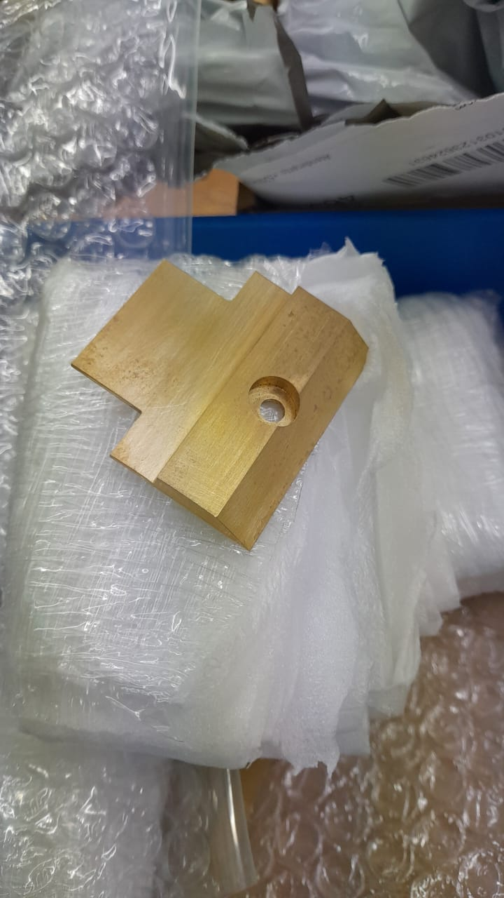
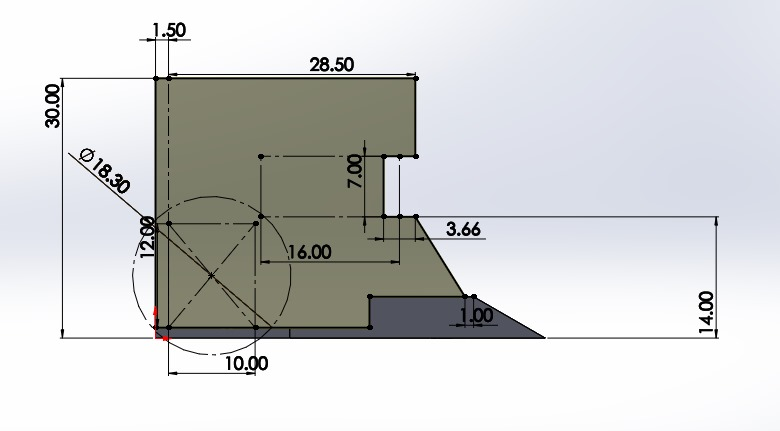
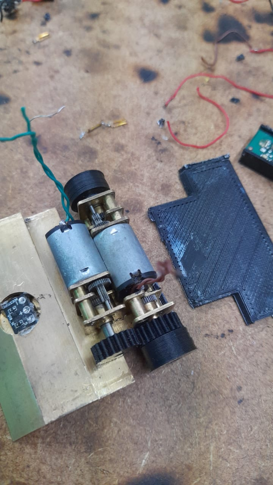
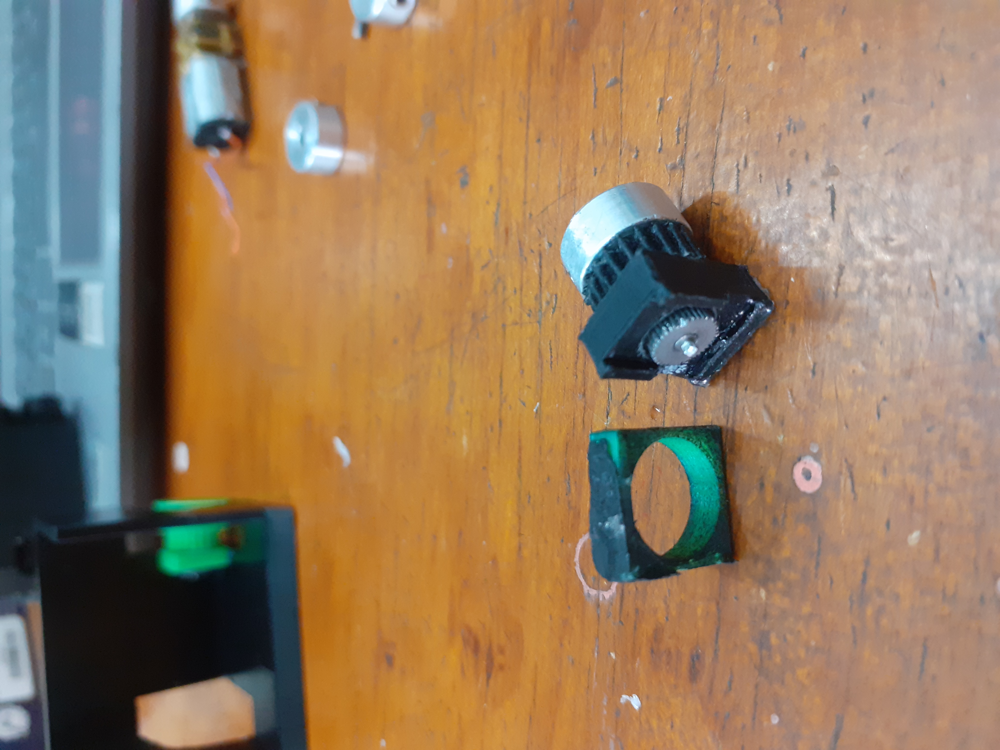
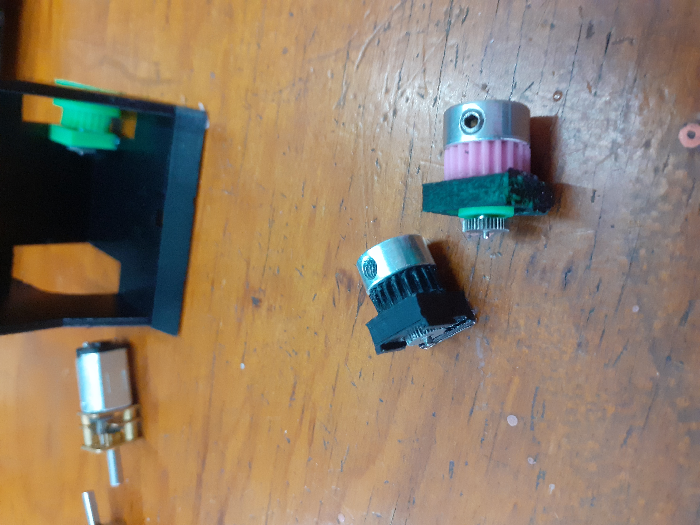
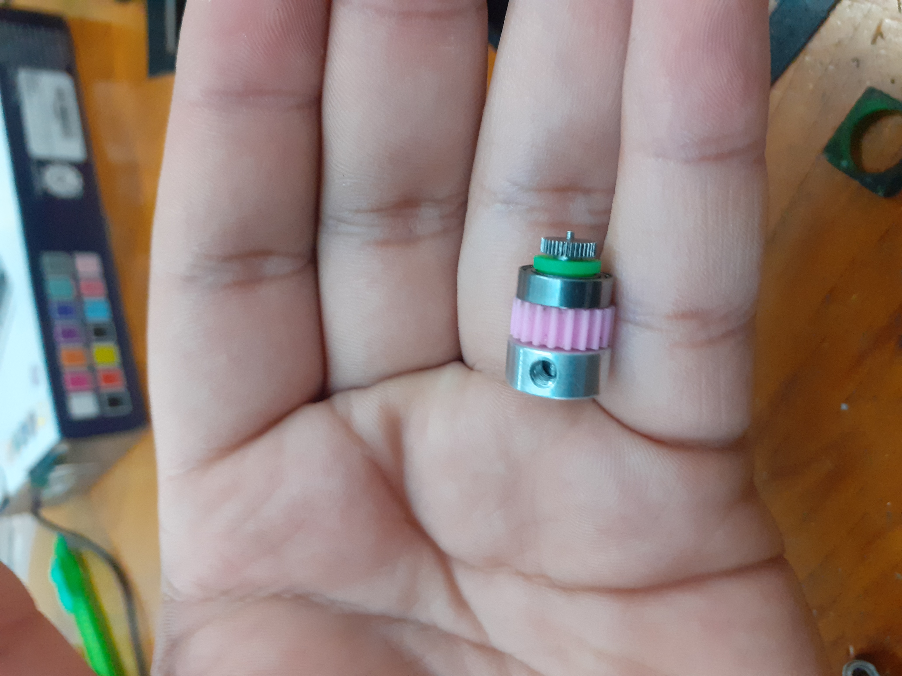

# Diseño y Ensamble

El diseño del prototipo, al igual que el diseño de la PCB o la programación, evoluciona con el tiempo. Se prueba una cosa y otra, y aunque al principio puede que no se tenga un buen prototipo (o si), después de dos o tres competencias podrías identificar aspectos que necesiten cambios. Nuevas ideas y mejoras siempre surgen. Por eso, en esta parte del repositorio se presentará una idea general del diseño mecánico del robot, así como del ensamble del prototipo. Como en todo el repositorio, puedes seguir estos pasos al pie de la letra o adaptarlos según tus necesidades.

***Aunque sé que dice "Diseño", y lo más probable es que se piense que aquí enseñaré cómo diseñar un microsumo, la realidad es que con los archivos que se están compartiendo ya se tiene una idea clara de cómo hacerlo. Por lo tanto, esta sección se centrará más en consejos prácticos y el ensamblaje del prototipo.***

## Tabla de Contenidos
1. [Descripción](#descripción)
2. [Base latón](#base-latón)
3. [PLA](#PLA)

## Descripción

El archivo base_microsumo_pro.rar contiene una base diseñada en SolidWorks (versión 2019), destinada a ser fabricada en latón. Puede ser enviada a maquilar en JLCPCB, PCBWAY, o cualquier otro lugar. Este archivo es totalmente modificable y lo puedes ajustar según tus necesidades.

No es fundamental usar una base de latón en un microsumo, versiones anteriores que se han realizado, la carcasa del robot ha sido completamente de PLA con peso muerto (plomo), ha funcionado bastante bien, así que, si se prefiere usar PLA y plomo es una opción bastante viable, en el archivo Microsumo_v10.rar es una idea de lo que se usaba. Igual es totalmente modificable.

***Tip***
- El ángulo donde se coloca la navaja generalmente varía entre 20° y 30° de inclinación. Como recomendación, se sugiere usar un ángulo de 27°.

## Base latón

Una vez que se tiene la base de latón en proceso de fabricación o en su posesión, ya sea que se haya mandado a hacer con la opción presentada, modificado el diseño existente o incluso creado uno propio, se procederá a diseñar la carcasa del prototipo. 

Para esto, daré dos opciones que he utilizado, las cuales llamaremos *Paredes* y *Base Sensores*. 
- Paredes: Como su nombre lo indica, se tendran las paredes laterales y trasera, fabricadas de PLA o cualquier otro filamento.
- Base Sensores: consiste en una pequeña base donde se colocaran los sensores y la tapa frontal, también fabricada de PLA.

En ambas opciones, la tapa frontal será construida de una herramienta conocida como [cuña](https://www.brochasexito.com.mx/productos/Accesorios/Cunas-Exito-de-Acero), esta herramienta se puede conseguir en COMEX (Mexico).

### Paredes

Se diseñará en la parte de arriba de la base algo como lo siguiente.

Las medidas dependerán de los sensores, batería(s), llantas y motores que se estén utilizando. En el ejemplo anterior se emplearon dos baterías de litio de 3.7V y 140mAh (RADOX), tres sensores de proximidad IR Pololu 38kHz de ganancia fija, dos micromotorreductores N20 de relación 30:1, un sensor QTR (de autoría propia), además de un par de rines y llantas.

Aunque se pueden hacer mejoras, por ejemplo:
- La tapa trasera podría reducirse a 1 mm o 0.5 mm.
- La medida de 28.5 mm podría ajustarse a 25 mm.
- La altura de 30 mm podría reducirse a 25 mm o 27 mm.

Estos cambios modificarían ciertas partes del diseño, pero considero que quedarían a la perfección. Es cuestión de experimentar con lo que se tiene y ajustar según las necesidades.

#### Ensamblaje

Se puede pintar la base o colocar una pegatina, ya sea en un acabado totalmente negro, brillante o mate o tipo fibra de carbono. Esto dependerá del gusto de cada persona.

A partir de aquí, el ensamblaje será el mismo si se utilizan motores N20 rectos, ya que existen diferentes modelos. ¿Qué significa que será el mismo? Justamente eso: sin importar cuál opción se utilice (Paredes o Base Sensores, con base de latón o PLA), la forma en la que se colocarán los motores y cómo se transmitirá la potencia será igual para todas las configuraciones. Por lo tanto, se explicará el proceso con el máximo detalle.

La idea es colocar los motores de la siguiente manera.

Para lograr esto, hay un aspecto que se debe observar con detalle: debido a las medidas, los motores no pueden colocarse de forma colineal. La solución consiste en configurar el sistema de la siguiente manera: se utilizan dos engranajes del mismo tamaño, lo que permite tener una relación 1:1. En esta configuración, un engranaje está conectado al eje del motor y el otro a una caja de reducción.

Existe otra forma de implementar esta configuración, que consiste en colocar un rodamiento en una pieza impresa en 3D y usar un eje de motor. Aunque esta opción resulta útil, en mi experiencia, no proporciona el resultado deseado. Por esta razón, se optó por utilizar una caja de reducción de los mismos motores, pero únicamente la última parte, que es la encargada de sostener el eje. Esta solución resulta bastante práctica y funcional.

En las tres figuras de abajo se muestran ejemplos del sistema con rodamiento.

***Tip***

Los rines y engranes pueden fabricarse en PLA. Personalmente, suelo utilizar rines de aluminio y engranajes de PLA. Sin embargo, en AliExpress he encontrado engranajes de latón, que podrían resultar bastante útiles dependiendo de la aplicación.

En cuanto a las llantas, aquí en México las consigo a través de compañeros de otros equipos que las venden. Parece que siempre es un reto conseguir esas llantitas.

### Base Sensores

