# Diseño y Ensamble

El diseño del prototipo, al igual que el diseño de la PCB o la programación, evoluciona con el tiempo. Se prueba una cosa y otra, y aunque al principio puede que no se tenga un buen prototipo (o si), después de dos o tres competencias podrías identificar aspectos que necesiten cambios. Nuevas ideas y mejoras siempre surgen. Por eso, en esta parte del repositorio se presentará una idea general del diseño mecánico del robot, así como del ensamble del prototipo. Como en todo el repositorio, puedes seguir estos pasos al pie de la letra o adaptarlos según tus necesidades.

***Aunque dice "Diseño", y lo más probable es que se piense que aquí se enseñará a cómo diseñar un microsumo, la realidad es que con los archivos que se están compartiendo ya se puede tener una idea clara de cómo hacerlo. Por lo tanto, esta sección se centrará más en consejos prácticos y el ensamblaje del prototipo.***

## Tabla de Contenidos
1. [Descripción](#descripción)
2. [Base latón](#base-latón)
   - [Paredes](#paredes)
     - [Ensamblaje](#ensamblaje)
   - [Base sensores](#base-sensores)
4. [PLA](#pla)

## Descripción

El archivo base_microsumo_pro.rar contiene una base diseñada en SolidWorks (versión 2019), destinada a ser fabricada en latón. Puede ser enviada a maquilar en JLCPCB, PCBWAY, o cualquier otro lugar. Este archivo es totalmente modificable y lo puedes ajustar según tus necesidades.

No es fundamental usar una base de latón en un microsumo, versiones anteriores que se han realizado, el chasis del robot ha sido completamente de PLA con peso muerto (plomo), ha funcionado bastante bien, así que, si se prefiere usar PLA y plomo es una opción bastante viable, en el archivo Microsumo_v10.rar es una idea de lo que se usaba. Igual es totalmente modificable.

***Tip***
- El ángulo donde se coloca la navaja generalmente varía entre 20° y 30° de inclinación. Como recomendación, se sugiere usar un ángulo de 25°.

## Base latón

Una vez que se tiene la base de latón en proceso de fabricación o en su posesión, ya sea que se haya mandado a fabricar la opción presentada, modificado el diseño existente o incluso creado una propia, se procederá a diseñar el chasis del prototipo. 

Para esto, se darán dos opciones que hemos utilizado, las cuales llamaremos *Paredes* y *Base Sensores*. 
- Paredes: Como su nombre lo indica, se tendrán las paredes laterales y trasera, fabricadas de PLA o cualquier otro filamento.
- Base Sensores: consiste en una pequeña base donde se colocaran los sensores y la tapa frontal, también fabricada de PLA.

En ambas opciones, la tapa frontal será construida de una herramienta conocida como [cuña](https://www.brochasexito.com.mx/productos/Accesorios/Cunas-Exito-de-Acero), esta herramienta se puede conseguir en COMEX (Mexico).

### Paredes

Se diseñará en la parte de arriba de la base algo como lo siguiente.

Las medidas dependerán de los sensores, batería(s), llantas y motores que se estén utilizando. En el ejemplo anterior se emplearon dos baterías de litio de 3.7V y 140mAh (RADOX), tres sensores de proximidad IR Pololu 38kHz de ganancia fija, dos micromotorreductores N20 de relación 30:1, un sensor QTR (de autoría propia), además de un par de rines y llantas.

Aunque se pueden hacer mejoras, por ejemplo:
- La tapa trasera podría reducirse a 1 mm o 0.5 mm.
- La medida de 28.5 mm podría ajustarse a 25 mm.
- La altura de 30 mm podría reducirse a 25 mm o 27 mm.

Estos cambios modificarían ciertas partes del diseño, pero consideramos que quedarían a la perfección. Es cuestión de experimentar con lo que se tiene y ajustar según las necesidades.

#### Ensamblaje

Se puede pintar la base o colocar una pegatina, ya sea en un acabado totalmente negro, brillante o mate o tipo fibra de carbono. Esto dependerá del gusto de cada persona.

Una vez que se tienen las impresiones en 3D de las paredes, estas se fijan a la base de latón utilizando Kola-Loka. Colóquese pared por pared, con calma, para tener un mejor resultado. El resultado final debería verse de la siguiente manera.

A partir de aquí, el ensamblaje será el mismo si se utilizan motores N20 rectos, ya que existen diferentes modelos. ¿Qué significa que será el mismo? Justamente eso: sin importar cuál opción se utilice (Paredes o Base Sensores, con base de latón o PLA), la forma en la que se colocarán los motores y cómo se transmitirá la potencia será igual para todas las configuraciones. Por lo tanto, se explicará el proceso con el máximo detalle.

La idea es colocar los motores como se muestra en la figura de abajo. 
Para fijar los motores a la base, se utiliza Kola-Loka. Como sugerencia adicional, se podría agregar un poco de bicarbonato a la mezcla. Esto genera una sustancia más fuerte y resistente.

***Tip***

- Supondremos que ya se cuentan con las llantas. Una sugerencia importante que debes seguir al pie de la letra es no fijar los motores al 100%. Utiliza únicamente la cantidad necesaria de Kola-Loka para que los motores queden semifijos y no se muevan.
Una vez que estén semifijados, coloca las llantas y verifica que no haya desnivel utilizando un espejo (por el reverso del mismo). Es fundamental asegurarse de que la parte donde se colocará la navaja quede recargada de manera uniforme sobre la superficie. Esto para que cuando se coloque la navaja no se tenga un lado alzado.

Para lograr esto, hay un aspecto que se debe observar con detalle: debido a las medidas, los motores no pueden colocarse de forma colineal. La solución consiste en configurar el sistema de la siguiente manera: se utilizan dos engranajes del mismo tamaño, lo que permite tener una relación 1:1. En esta configuración, un engranaje está conectado al eje del motor y el otro a una caja de reducción.

Existe otra forma de implementar esta configuración, que consiste en colocar un rodamiento en una pieza impresa en 3D y usar un eje de motor. Aunque esta opción resulta útil, en nuestra experiencia, no proporciona el resultado deseado. Por esta razón, se optó por utilizar una caja de reducción de los mismos motores, pero únicamente la última parte, que es la encargada de sostener el eje. Esta solución resulta bastante práctica y funcional.

En las tres figuras de abajo muestran ejemplos del sistema con rodamiento.

***Tip***

- Los rines y engranes pueden fabricarse en PLA. Personalmente, solemos utilizar rines de aluminio y engranajes de PLA. Sin embargo, en AliExpress hemos encontrado engranajes de latón, que podrían resultar bastante útiles dependiendo de la aplicación.

- En cuanto a las llantas, aquí en México las conseguimos a través de compañeros de otros equipos que las venden. Parece que siempre es un reto conseguir esas llantitas.

Para este punto, ya se deben de tener fijadas las paredes y los motores, asegurándose de que no haya ningún desnivel. A continuación, se procederá con la colocación de los sensores, las baterías y la PCB.

Baterías:

 - Primero, coloca las baterías en la parte trasera. Estas se pueden acomodar según las necesidades del diseño o el espacio disponible.

Sensores:

 - Coloca el sensor de piso utilizando un poco de silicona para fijarlo en su lugar.

 - Luego, instala los sensores IR. Aquí, el proceso dependerá del modelo de sensores que estés utilizando.

Nota sobre los sensores:

 - Los sensores más recomendables son los RZ60S de Sumozade, una empresa turca. Debido a sus dimensiones, son ideales para este tipo de robots. Si no es posible conseguirlos o no están disponibles al momento de ensamblar el prototipo, otras opciones viables son los JS40F de Jsumo (también turca) o los sensores Pololu mencionados anteriormente. O bien cualquier tipo de sensor con los que cuentes.

En este caso, se utilizaron sensores Pololu, lo que permitió que el prototipo adquiriera la siguiente forma a medida que avanzaba el ensamblaje.

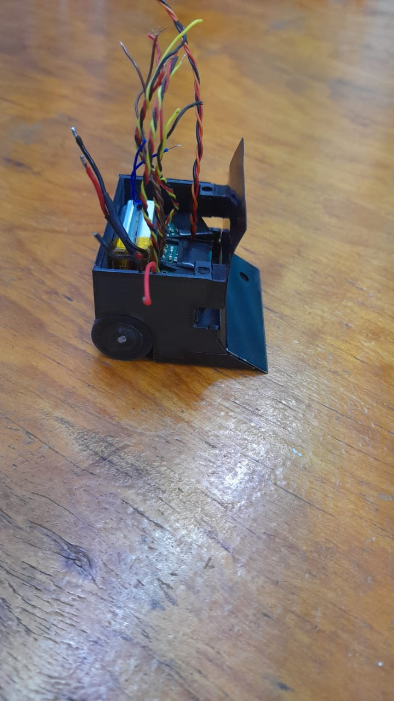

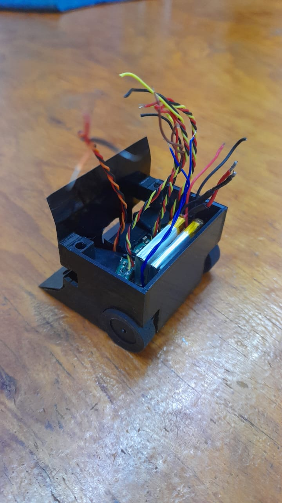

Si se utilizan sensores Pololu, aquí van algunos consejos útiles:

1. Diseñar una carcasa específica para los sensores:
   - Fija los sensores a la carcasa con silicona en la parte trasera. Esto no solo asegurará que los sensores queden firmes en su lugar, sino que también ayudará a proteger los cables soldados, evitando que se desprendan o se dañen.

3. Colocar cinta aislante en la parte superior:
   - Esto es importante debido a los emisores del sensor, ya que la cinta ayudará a reducir interferencias o lecturas erráticas.

4. Considerar una carcasa alternativa:
   - Si el diseño inicial no es suficiente o no se ajusta a tus necesidades, puedes optar por diseñar una carcasa diferente que se adapte mejor al prototipo.

5. Características del sensor Pololu:
   - Pin de enable: Permite habilitar o deshabilitar el emisor del sensor según sea necesario.
   - Potenciómetro (pot): Facilita la regulación de la distancia de detección. Generalmente a la mitad.

PCB:
 
 - La PCB se fija a las paredes colocando un tornillo M3, se puede colocar un inserto en las paredes para que después se coloque el tornillo.

En este paso, se coloca la PCB y, posteriormente, se sueldan los cables de los motores y sensores. Es importante soldar las baterías primero, ya que su posición puede dificultar la soldadura una vez que la PCB esté colocada. Alternativamente, puedes soldar todo el cableado antes de fijar la PCB para mayor comodidad. 

Tapa frontal:

 - La tapa frontal puede cortarse con la ayuda de un esmeril angular 4" (o como lo conozcas) y, utilizando un Dremel, se realiza el corte en la sección destinada para los sensores.

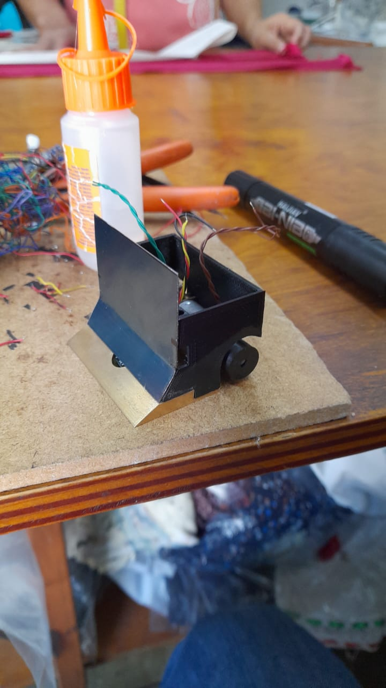

 - Se presenta la tapa y se enciende el robot para verificar que los sensores no presenten problemas de interferencia con esta. Se sugiere pintar la tapa de negro por ambos lados para evitar reflejos o interferencias ópticas.

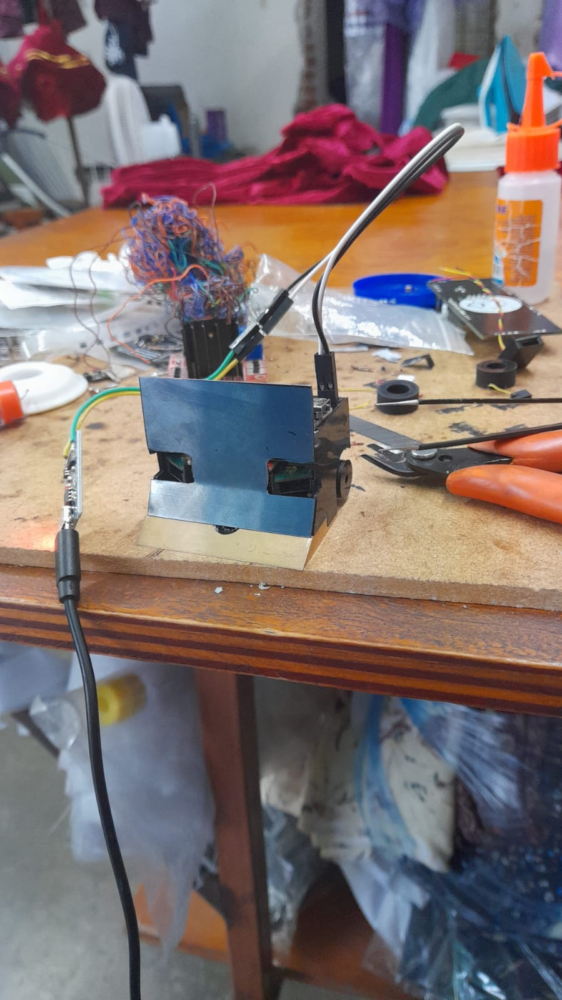

La tapa se fija a las paredes, usando Kola-Loka.

Ya se han colocado las paredes, motores, sensores, baterías, tapa y llantas; lo único que resta es colocar la navaja.

Es importante elegir el tipo de navaja adecuado. En las primeras versiones del prototipo, utilizábamos navajas de cúter pequeño, las cuales se cortaban a la medida de 50 mm. Más adelante, un compañero de competencia me regaló una navaja Kanzawa de 50 mm. Desde entonces, hemos utilizado este tipo de navajas, que son de origen japonés y un poco complicadas de conseguir, pero no imposible.

Existen otras opciones, pero como con todo lo mencionado en este repositorio, dependerá del ingenio y creatividad que se apliquen al proyecto.

Para colocar la navaja a la base se utiliza cinta doble cara. Hay en el mercado bastante opciones, aqui dare dos opciones, cinta que se consigue en [Walmart Cinta de Montaje Ceys Montack Doble Cara Rojo](https://super.walmart.com.mx/ip/cinta-de-montaje-ceys-montack-doble-cara-rojo-2-5-m/00841151977240?adBanner=super&adStoreId=0000009999&wl13=5727&utm_source=google&utm_medium=cpc&utm_advertiser=wmod_lia-multi-channel-all&utm_campaign=wmod_lf_sem_sitio_conversion_ao_shopping-lia-multi-channel-all&utm_term=_&utm_content=&gad_source=1&gclid=CjwKCAiAgoq7BhBxEiwAVcW0LGG02QXZycH2BXxB4lqzJFFQHLYqDIytriO6XkfnCFHCVhs3XfGuQRoCTu0QAvD_BwE) y en Aliexpress [Cinta de doble cara súper fuerte de 5M](https://es.aliexpress.com/item/1005006277925414.html?sourceType=1&spm=a2g0o.wish-manage-home.0.0&gatewayAdapt=glo2esp).

En la figura de abajo se pueden observar tres diferentes tipos de navajas utilizadas: Navaja cortada, Kanzawa cortada, Kanzawa de 50mm. 

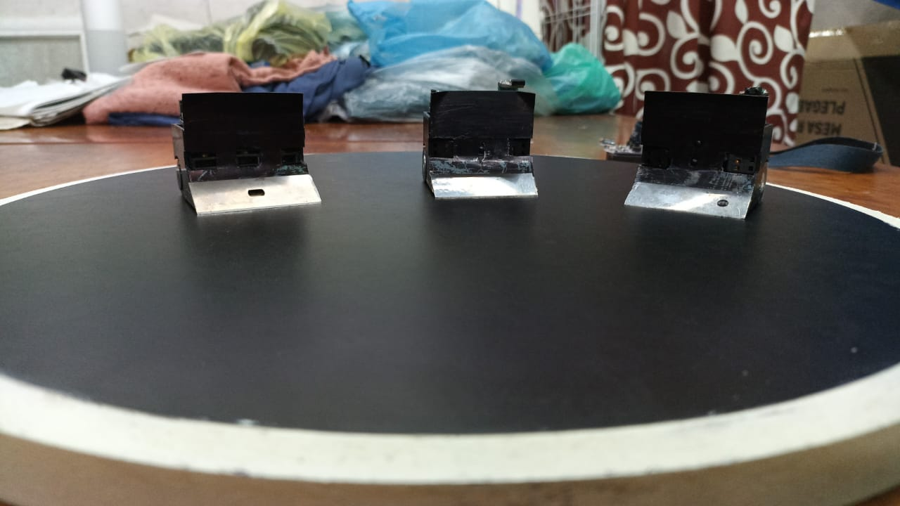

***Tip***

- Número de sensores: Este número puede variar dependiendo del gusto o las necesidades del diseño. Usualmente, hemos utilizado de 3 a 4 sensores: uno para el piso y tres(dos) para la detección del oponente. La colocación también depende de lo que desees lograr. Puedes optar por poner uno que mire hacia enfrente y dos en los laterales, de forma que los emisores sean visibles pero los receptores no. O bien, puedes poner los receptores visibles y los emisores ocultos.
- Colocación de la navaja: Para colocar la navaja, coloca un poco de cinta en la parte de la navaja, usando no más de la mitad de la superficie. Luego, pégala a la base. Con un espejo, coloca el robot encima y observa desde atrás para verificar que no entre luz, lo cual indicaría que la navaja está calibrada correctamente. Mueve el robot un poco para asegurarte de que la navaja no raspe el suelo. Después de cada combate, revisa que la navaja siga bien colocada. Si no es así, simplemente empuja la navaja hacia abajo desde el lado donde entra luz.  ***Este proceso requiere bastante practica y se va a ir mejorando con el paso de las competencias***
- Añadir peso al frente: Si lo consideras necesario, puedes añadir peso al frente del robot. Lo ideal es llevar al robot a su límite máximo de peso, que debería estar entre 98 y 100 gramos como máximo. ~~Una mala práctica es llevar el robot al límite, que se homologué sin arrancador y cuando se coloque el arrancador te dé un peso de 101 -102 gr. Pareciera poco, pero se nota la diferencia de peso~~.

El resultado final que deberías de tener es algo como lo siguiente.

Los mismos robots pero en un angulo diferente.

### Base Sensores

Para este diseño, la idea principal es sencilla: concentrar el mayor peso en la parte delantera del robot. Esto se logra mediante las siguientes modificaciones:

- Quitar las paredes laterales: Eliminando el peso innecesario de las paredes laterales, se puede redistribuir el peso hacia la parte frontal.
- Reducir la pared trasera: Disminuyendo su tamaño o grosor, se aligera la parte trasera.
- Utilizar baterías más pequeñas: Un par de baterías de menor tamaño permitirá liberar espacio y peso, las beterías pueden ser del mismo amperaje, pero con diferentes dimensiones.

Con estas optimizaciones, el peso liberado puede ser utilizado para añadir materiales como latón, plomo, u otros elementos pesados en la parte frontal del robot, actuando como peso muerto.

El resultado sería un diseño como el que se ilustra en la siguiente figura.

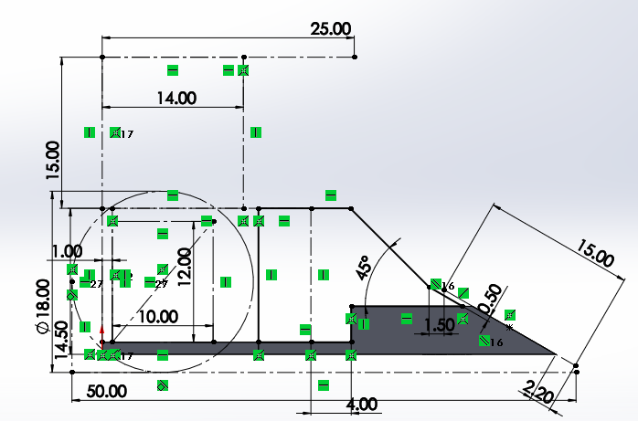

Una vez que se tiene la pieza impresa en 3D y la tapa trasera de aproximadamente de un grosor de 0.5 mm, se procede con los siguientes pasos ya antes explicados:

- Montar las piezas en la base de latón: Ambas partes deben fijarse con Kola-Loka
- Colocar los componentes: Sigue el procedimiento explicado anteriormente para instalar los motores, sensores, baterías y la tapa delantera. Recuerda revisar que todo esté correctamente alineado y ajustado, sin interferencias entre los componentes.

  ***Tip**
  - Usa baterías de mínimo 100mah ya que hemos probado con baterías de 80mah y estas han fallado a la hora de estar en combate.
  - Puedes rediseñar la tapa delantera, modificar la colocación de los motores e incluso ocupar las mismas baterías.

Al finalizar, deberías tener un prototipo ensamblado similar al que se muestra en las siguientes imágenes, con una distribución de peso optimizada.

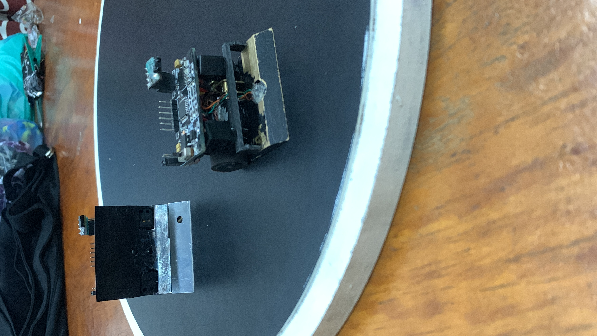

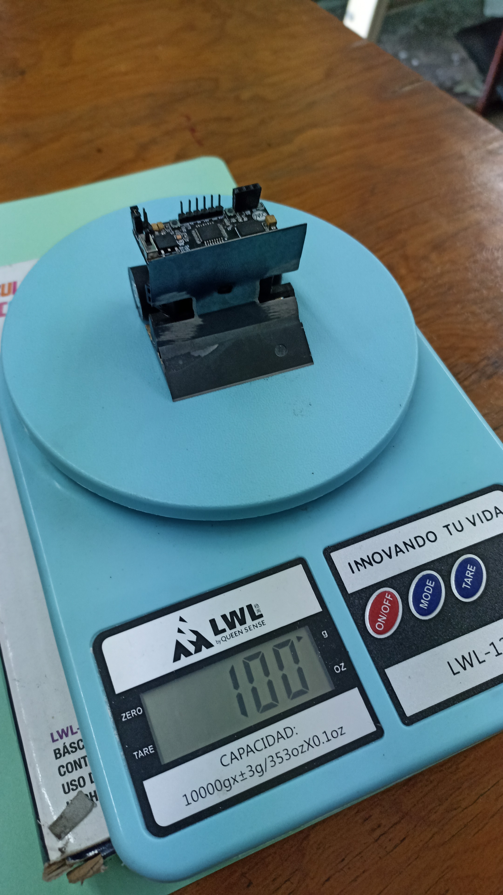

Si jugaste bien con las medidas a la hora de diseñar, la PCB se podrá fijar con cinta doble cara a los sensores (depende de los sensores que se ocupen).

**Nota:** En la segunda figura se puede observar que el robot está al límite y aún no cuenta con el arrancador, por lo que se le tendría que quitar un poco de peso muerto para que, a la hora de colocar el arrancador, este no tenga problemas de homologación.

Hasta aquí se presenta la opción utilizando una base de latón. Puedes modificar la base de latón, haciéndola un poco más pequeña y con mayor peso adelante, de manera que solo sea necesario colocar los sensores y demás componentes. También existe la posibilidad de no usar una base de latón y, en su lugar, combinar la idea de Base Sensores con la siguiente opción que se presentará. Todo dependerá del gusto y lo que se necesite.

## PLA

En esta sección seremos breve, ya que el proceso de colocar los motores, elegir los sensores, seleccionar la navaja y fabricar la tapa frontal ya ha sido explicado. Por lo tanto, solo se presentará una explicación breve con algunas ideas sobre por qué realizarlo de esta manera.

Puede presentarse el caso de que no se cuente con los recursos necesarios para obtener una base de latón. En este caso, una buena alternativa es diseñar un chasis de PLA y añadir plomo como peso muerto. Esta opción, en nuestra opinión, ofrece un mayor margen para implementar ideas creativas.

En el archivo microsumo_v10 se encuentra el diseño del último microsumo que uno del equipo realizó utilizando esta metodología. En ese entonces, usaba una batería Tattu de 7.4V 300mAh, sensores Pololu y aluminio como peso muerto, ya que no disponía de plomo. A decir verdad, este diseño le permitió obtener algunas victorias y alcanzar uno que otro podio en competencias.

Sin embargo, siempre hay margen para mejorar. Por ejemplo, modificar completamente el chasis para utilizar baterías individuales, lo que ahorra espacio; emplear sensores RZ60S o continuar con Pololu; reducir las paredes del chasis; y agregar plomo en la parte delantera. Con estos ajustes, el diseño sería más eficiente, ya que un compañero del equipo utiliza esta idea y le ha dado excelentes resultados.

La idea es como la siguiente, tener el chasis de PLA y colocar plomo:

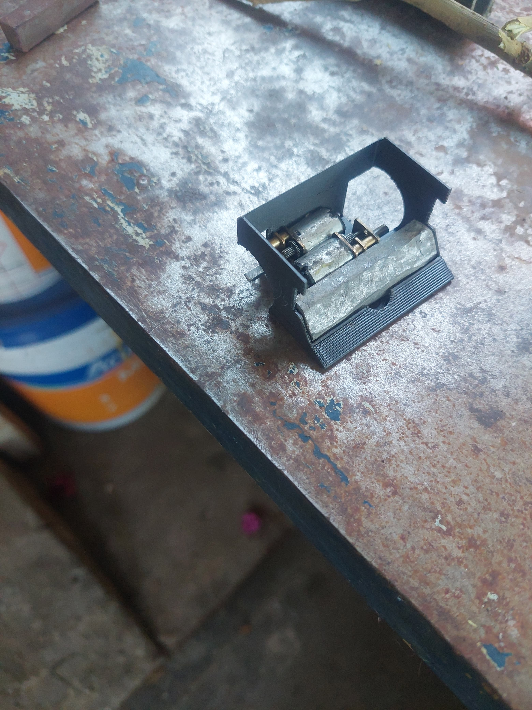

El demás ensamblaje seria el mismo.

En las siguientes dos figuras se muestran ideas de prototipos que fueron desarrollados, actualmente estas ideas están retiradas, pero pueden ser de ayuda como referencia y entendimiento de la opción presentada.

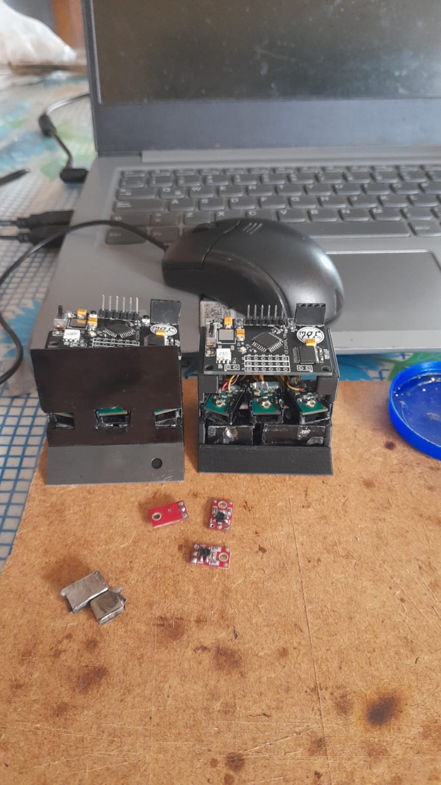

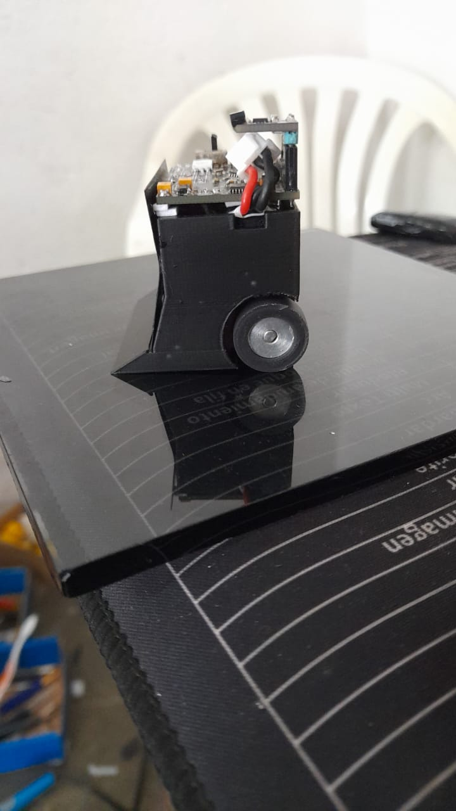

En la siguiente figura se muestra la idea actual desarrollada por un compañero.

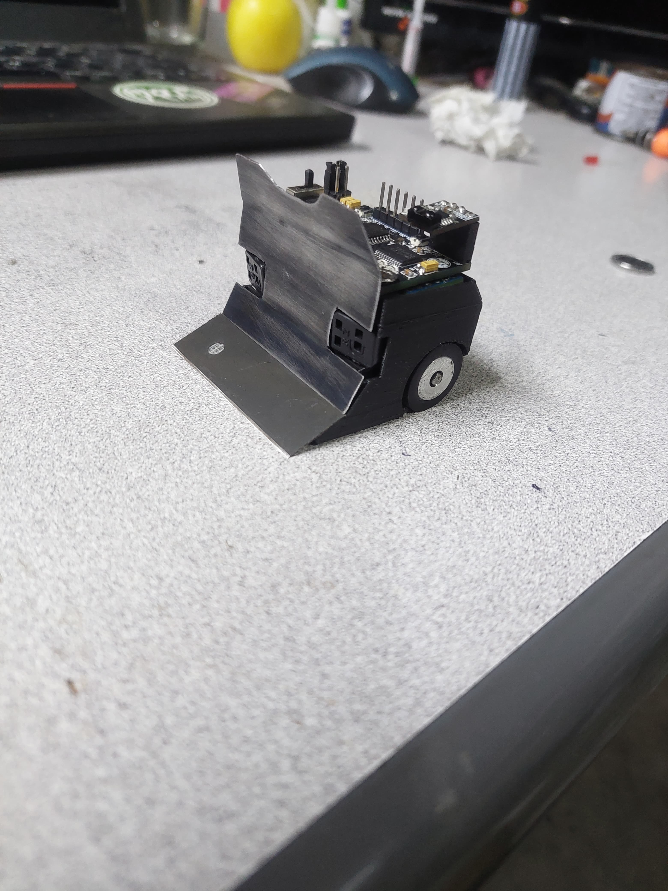

Como se puede observar se dio una explicación lo más clara posible, si surgiera alguna duda puedes contactar con los autores de este repositorio, esperamos que todo esto te ayude en el diseño de tu prototipo.
