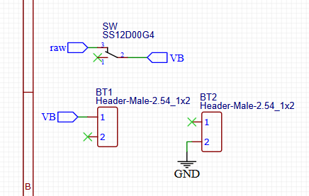
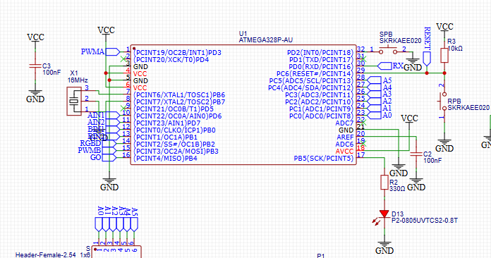
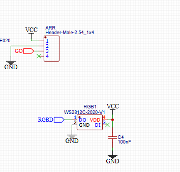
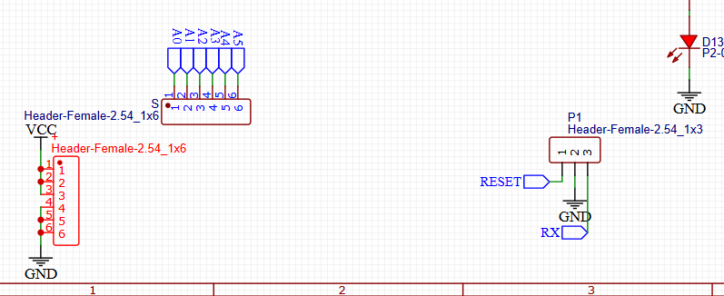
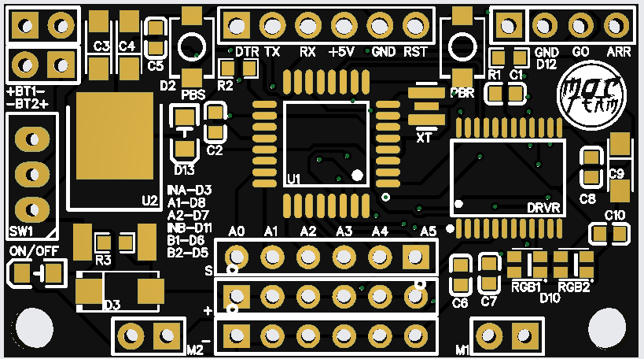
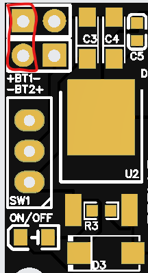
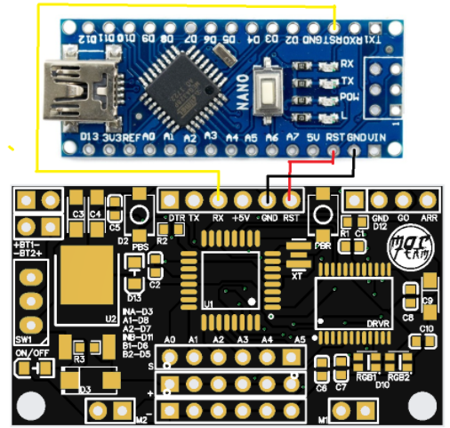
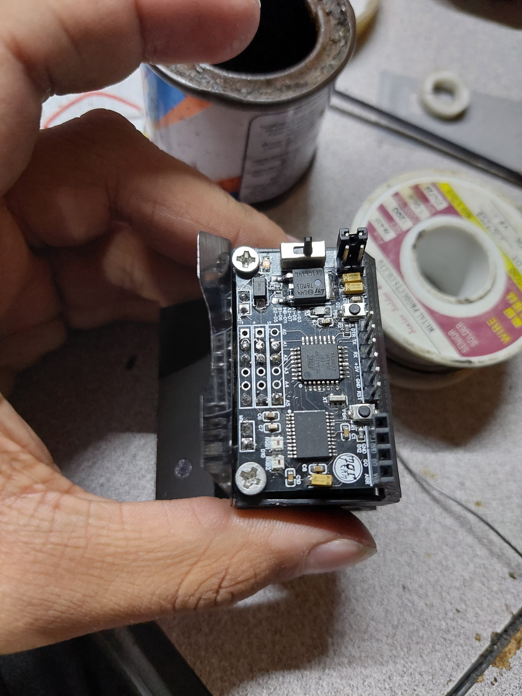

# PCB
Obtener una PCB funcional para cualquier prototipo que se este desarrollando puede ser una tarea significativa, ya que requiere tiempo, investigación y numerosas pruebas. Estar seguro de que el prototipo que se tiene será el último antes de mandarlo a fabricar es crucial. Es por eso que en esta sección del repositorio, te compartimos una opción viable que se podría considerar a la hora de realizar un microsumo.

## Tabla de Contenidos
1. [Descripción](#descripción)
2. [Esquemático](#esquemático)
3. [PCB MOCteam](#pcb-mocteam)
   1. [PINOUT](#pinout)

## Descripción
Como se mencionó anteriormente, esta es una tarea significativa. Si logras encontrar una PCB comercial, el proceso será mucho más sencillo, ya que alguien más habrá realizado este trabajo por ti.

En caso de que no se tenga acceso a una, aquí te compartimos una PCB diseñada específicamente para este propósito. Sus dimensiones son 45 mm x 25 mm, lo que la hace perfecta para las especificaciones de un 
microsumo. Esta PCB fue diseñada en EasyEDA, y puedes cargar el archivo Gerber en el servicio de JLCPCB para su fabricación.

Es muy posible que cuando encuentres este repositorio, ya sea por un video, una investigación o cualquier otro medio, no se tenga el acceso a los componentes necesarios. Por ello, se incluye una sección del esquemático para que se pueda replicar la PCB.

Si se es nuevo en este mundo, lo más probable es que debas investigar y buscar los componentes que utilizarás. Aunque no es un proceso complicado, puede resultar algo tedioso. La recomendación es que utilices componentes con medidas 0603, ya que tienen un tamaño ideal para soldar con cautín, en caso de que no cuentes con una estación de soldadura.

En cuanto a proveedores, se sugiere LCSC Electronics, que forma parte de JLCPCB, o también Aliexpress como alternativa.

Si no se tiene la experiencia soldando PCBs, se recomienda tomarlo con calma y tener paciencia. Soldar requiere práctica, pero es algo que se puede aprender desde cero. Personalmente, todas las PCBs que hemos ensamblado, han sido utlizando únicamente un cautín. 

Por ultimo, la placa tiene como mCU un Atmega328p-au por lo que se puede programar usando el IDE de Arduino. En la sección de PCB MOCteam se explica como cargar un programa usando un Arduino nano.

**Nota: Si se usa cautín, se recomienda tener malla desoldadora de cobre.**

**Nota: El esquematico pdf y el gerber son diferentes pero es basicamente lo mismo**

## Esquemático

[***Los componentes se encuentran en el BOOM***](BOM_Microsumo_30_11_2024_2024-12-15.csv)

[***Archivo completo en el PDF Schematic_Microsumo***](Schematic_Microsumo_30_11_2024_2024-12-15.pdf)

En la primera parte, se encuentran dos headers que servirán para la conexión de las baterías (batería de Li-ion 3.7V a 140mAh) y el interruptor. Al momento de diseñar la PCB, se sugiere que estos headers estén lo más cerca posible, ya que se requiere un jumper para la suma de voltajes.

En la segunda parte, se encuentra el circuito de regulación de voltaje con un 7805. Esta sección incluye un LED que indicará cuando la PCB esté energizada.

La tercera parte es un microcontrolador (mCU), el IC Atmega328p-au, con los componentes necesarios para que funcione de manera eficiente. Aquí es importante prestar atención, ya que, si se quiere o requiere añadir el pin de DTR, se debe colocar una conexión con un capacitor (0.1µF) entre el RPB y la resistencia de 10k, y la otra conexión al pin asociado al DTR. El SPB en el código estará configurado como PULLUP, por lo que está conectado de esta manera. Además, si se quiere habilitar el pin TX, se debe colocar un indicador que lo mande a ese pin (31).

En la cuarta parte se tiene el arrancador y el RGB. Se podría agregar otro RGB, solo se necesita habilitar el pin DI y conectarlo al DO del nuevo RGB; lo demás es igual. Si requiere agregar el pin RDY del arrancador, se puede asociar a un pin disponible del mCU.

La quinta parte corresponde a la alimentación y señal de los sensores. En P1 podría agregarse el pin TX y DTR, y es donde se programara la PCB.

La sexta y última parte corresponde al controlador de motores, que es el TB6612FNG, un componente bastante eficiente para controlar motores DC.

[***Esquemático del Arduino pro mini***](https://www.arduino.cc/en/uploads/Main/Arduino-Pro-Mini-schematic.pdf)

## PCB MOCteam

Si has decidido en mandar a fabricar la opción que se presentó, aquí se explicará qué es y dónde se encuentran cada una de las entradas y salidas de la tarjeta.

Una vez fabricada y ensamblada, tendrás las PCBs tal como se muestra a continuación, ya con todos los componentes soldados. Si observas, cada pin está identificado mediante serigrafía, lo que facilita saber a qué está asociado.

*En la figura de abajo no contiene componentes para una mejor compresión.*

En la etapa de regulación consiste en soldar dos baterías con dos header para poder cargarlas, se debe añadir un jumper en la parte externa de los headers. Además se tiene un regulador, un led como indicador, compontes pasivos y un diodo para protección de la tarjeta.

Para cargar el programa a la PCB, se necesitara un Arduino Nano. Solo se utilizarán los pines RST, GND y RX. Se conecta el Arduino Nano a la computadora y se carga el programa como se haría normalmente. Durante el proceso, el LED asociado al pin 13 de cada placa parpadeara, y cuando en el IDE de Arduino aparezca el mensaje de que la carga ha finalizado, el proceso habrá concluido.

**Nota: Si no se carga el programa, puede ser debido a que el mCU no tiene el [bootloader](https://tutoriales.rantec.mx/manual-para-cargar-bootloader-en-arduino/), en cuyo caso se tendrá que quemar. También puede ser que el resonador no esté bien soldado.**

### PINOUT

No hay mucho que agregar sobre el Pinout, ya que está serigrafiado, lo que facilita identificar a qué pin está asociado cada componente. Sin embargo, a continuación se detallan algunos puntos clave por si surge alguna duda:

- Recuadro color rosa: Contiene un botón pulsador (PBS) de propósito general, el cual está asociado al pin D2.
- Recuadro color amarillo: Incluye un LED conectado al pin D13.
- Recuadro color rojo: Está asociado a los pines que se conectan directamente al controlador de motores.
- Recuadro color naranja: Corresponde a los pines de entrada para los sensores. Aunque comúnmente se utilizan como pines analógicos, también pueden configurarse como entradas digitales, es decir, tienen - - -- funcionalidad dual. Los pines asociados son D14, D15, D16, D17, D18 y D19.
- Recuadro color morado: Contiene los LEDs RGB, que funcionan con un único pin de control, el D10.
- Recuadro color azul: Corresponde al arrancador, asociado al pin D12.

Al final de toda esta explicación la PCB debería verse de la siguiente manera. 

