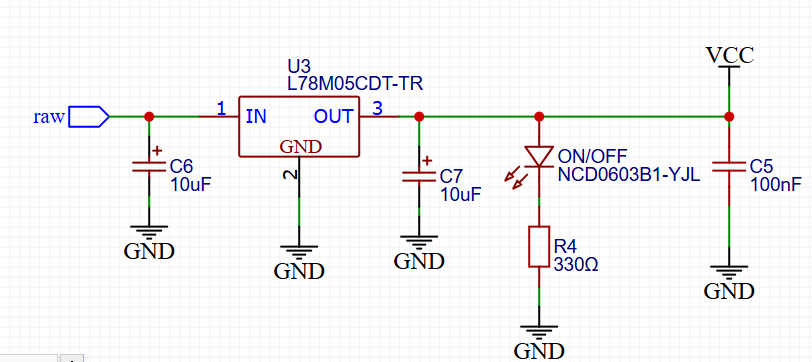
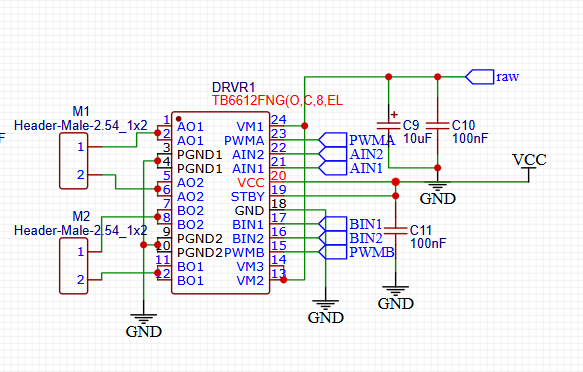

# PCB
Obtener una PCB funcional para cualquier prototipo que estés desarrollando puede ser una tarea significativa, ya que requiere tiempo, investigación y numerosas pruebas. Estar seguro de que el prototipo que tienes será el último antes de mandarlo a fabricar es crucial. Es por eso que en esta sección del repositorio, te comparto una opción viable que podrías considerar a la hora de realizar un microsumo.

## Tabla de Contenidos
1. [Descripción](#descripción)
2. [Esquemático](#esquemático)
3. [PinOut](#pinout)
4. [Programación](#programación)

## Descripción
Como mencioné anteriormente, esta es una tarea significativa. Si logras encontrar una PCB comercial, el proceso será mucho más sencillo, ya que alguien más habrá realizado este trabajo por ti.

En caso de que no tengas acceso a una, aquí te comparto una PCB diseñada específicamente para este propósito. Sus dimensiones son 45 mm x 25 mm, lo que la hace perfecta para las especificaciones de un microsumo. Esta PCB fue diseñada en EasyEDA, y puedes cargar el archivo Gerber en el servicio de JLCPCB para su fabricación.

Es muy posible que cuando encuentres este repositorio, ya sea por un video, una investigación o cualquier otro medio, no tengas acceso a los componentes necesarios. Por ello, aquí incluyo una sección del esquemático para que puedas replicar la PCB.

Si eres nuevo en este mundo, lo más probable es que debas investigar y buscar los componentes que utilizarás. Aunque no es un proceso complicado, puede resultar algo tedioso. Mi recomendación es que utilices componentes con medidas 0603, ya que tienen un tamaño ideal para soldar con cautín, en caso de que no cuentes con una estación de soldadura.

En cuanto a proveedores, te sugiero LCSC Electronics, que forma parte de JLCPCB, o también Aliexpress como alternativa.

Si no tienes experiencia soldando PCBs, te recomiendo tomarlo con calma y tener paciencia. Soldar requiere práctica, pero es algo que se puede aprender desde cero. Personalmente, todas mis PCBs las he ensamblado usando únicamente un cautín RADOX, y ha funcionado perfectamente. 

Por ultimo, la placa tiene como mCU un Atmega328p-au por lo que puedes programar usando el IDE de Arduino. En la sección de código explico sobre como cargar el programa usando un Arduino nano.

**Nota: Si usas cautín, te recomiendo tener malla desoldadora de cobre.**

**Nota: El esquematico pdf y el gerber son diferentes pero es basicamente lo mismo**

## Esquemático

[***Los componentes se encuentran en el BOOM***](BOM_Microsumo_30_11_2024_2024-12-15.csv)

[***Archivo completo en el PDF Schematic_Microsumo***](Schematic_Microsumo_30_11_2024_2024-12-15.pdf)

En la primera parte, tenemos dos headers que nos servirán para la conexión de las baterías (batería de Li-ion 3.7V a 140mAh) y el interruptor. Al momento de diseñar la PCB, sugiero que estos headers estén lo más cerca posible, ya que se requiere un jumper para la suma de voltajes.

En la segunda parte, tenemos el circuito de regulación de voltaje con un 7805. Esta sección incluye un LED que nos indicará cuando la PCB esté energizada.

La tercera parte es nuestro microcontrolador (MCU), el IC Atmega328p-au, con los componentes necesarios para que funcione de manera eficiente. Aquí es importante prestar atención, ya que si queremos añadir el pin de DTR, se debe colocar una conexión con un capacitor (0.1µF) entre el RPB y la resistencia de 10k, y la otra conexión al pin asociado al DTR. El SPB en el código estará configurado como PULLUP, por lo que está conectado de esta manera. Además, si se quiere habilitar el pin TX, se debe colocar un indicador que lo mande a ese pin (31).

En la cuarta parte tenemos el arrancador y el RGB. Podemos agregar otro RGB, solo necesitamos habilitar el pin DI y conectarlo al DO de nuestro nuevo RGB; lo demás es igual. Si queremos agregar el pin RDY de nuestro arrancador, podemos asociarlo a un pin disponible de nuestro mCU.

La quinta parte corresponde a la alimentación y señal de nuestros sensores. En P1 podría agregarse el pin TX y DTR, y es donde se programara nuestra PCB.

La sexta y última parte corresponde a nuestro controlador de motores, que es el TB6612FNG, un componente bastante eficiente para controlar motores DC.

## PinOut

## Programación

**Nota: Si no se carga el programa, puede ser debido a que el mCU no tiene el bootloader, en cuyo caso tendrás que quemarlo. También puede ser que el resonador no esté bien soldado.**
